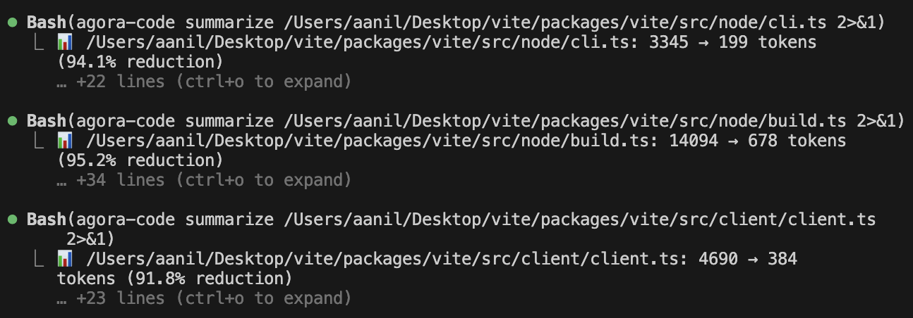

# agora-code

Persistent memory and context reduction for AI coding agents. Survives context window resets, new conversations, and agent restarts.

---



## Install

> **Prerequisites:** Python 3.10+ and pip. *(Fully tested on macOS.)*

### Step 1 — Install the package (once, globally)

Open a terminal and run:

```bash
pip install git+https://github.com/thebnbrkr/agora-code.git
```

Verify:

```bash
agora-code --version
```

**macOS permission error?** *(common on macOS system Python)* Use `--user` instead:

```bash
pip install --user git+https://github.com/thebnbrkr/agora-code.git
```

Then add the binary to your PATH — add this line to `~/.zshrc` or `~/.bashrc`:

```bash
export PATH="$(python3 -m site --user-base)/bin:$PATH"
```

---

### Step 2 — Set up a project

Run this in a terminal **outside of Claude Code** — Claude Code does not need to be open. *(macOS: use Terminal.app.)*

**Claude Code:**

```bash
cd your-project
agora-code install-hooks --claude-code
```

This creates:
- `.claude/settings.json` — registers all hooks with Claude Code
- `.claude/hooks/*.sh` — the hook scripts that fire automatically
- `~/.claude/skills/agora-code/SKILL.md` — enables `/agora-code` globally *(created once, works in all repos)*
- `.mcp.json` — registers the memory MCP server

Already have `.claude/settings.json`? Use `--force`:

```bash
agora-code install-hooks --claude-code --force
```

**Cursor:**

Copy the `.cursor/` directory from this repo into your project root:

```bash
cp -r /path/to/agora-code/.cursor your-project/.cursor
```

Or clone the repo and copy:

```bash
git clone https://github.com/thebnbrkr/agora-code.git /tmp/agora-code
cp -r /tmp/agora-code/.cursor your-project/.cursor
```

**Gemini CLI:**

Same approach — copy `.gemini/` into your project root:

```bash
cp -r /tmp/agora-code/.gemini your-project/.gemini
```

**Restart your editor** after setup.

---

### Step 3 — Start using it *(Claude Code)*

Open Claude Code in your project. At the start of every session, type:

```
/agora-code
```

This loads the skill — it tells Claude when to summarize files, when to inject context, and when to save progress. Without it, Claude doesn't know these rules exist.

Your previous session context is injected automatically on session start. To see what was loaded:

```bash
agora-code inject
```

---

### What happens automatically

| When you... | agora-code automatically... |
|---|---|
| Start a session | Injects last checkpoint + relevant learnings from recent commits |
| Submit a prompt | Recalls relevant past findings, sets session goal |
| Read a file > 50 lines | Summarizes it via AST — saves 75–95% of tokens |
| Edit a file | Tracks the diff, re-indexes symbols |
| Run `git commit` | Stores learnings derived from the commit |
| Context window compresses | Checkpoints before, re-injects after |
| End a session | Parses transcript → structured checkpoint in DB |

---

### Cursor / Claude Desktop / other MCP editors

For editors without hook support, add to your MCP config:

```json
{
  "mcpServers": {
    "agora-memory": {
      "command": "agora-code",
      "args": ["memory-server"]
    }
  }
}
```

Use `which agora-code` for the full path if your editor can't find it. Restart your editor.

---

### Optional: better recall with embeddings

*(This feature is actively being worked on — behaviour may change.)*

By default `recall` uses FTS5 keyword search — works with no setup. For semantic (fuzzy) search:

```bash
export OPENAI_API_KEY=sk-...          # OpenAI text-embedding-3-small
export GEMINI_API_KEY=...             # Gemini gemini-embedding-001
pip install "git+https://github.com/thebnbrkr/agora-code[local]"  # offline, no API key
```

---

## Two problems it solves

### 1. Token budget — large files eat your context fast

When an AI reads a 1000-line file it burns ~8000 tokens just for that read. agora-code intercepts every file read and serves a structured AST summary instead of raw source — typically **75–95% fewer tokens** while keeping all the signal.

**Summarization pipeline:**

| File type | Method | What you get |
|---|---|---|
| Python | stdlib AST | Classes, functions, signatures, docstrings, line numbers |
| JS, TS, Go, Rust, Java, Ruby, C#, Swift, Kotlin, PHP + 160 more | tree-sitter (real AST) | Same — exact line numbers, parameter types |
| JSON / YAML | Structure parser | Top-level keys + shape overview |
| Markdown / text | Heading extractor | Headings + opening paragraph |
| Anything else | Regex fallback | Function/class names, rough structure |

Token counting uses tiktoken (BPE cl100k_base) — the same tokenizer Claude and GPT-4 class models use.

**Example:** `summarizer.py` (885 lines) → 8,436 tokens raw → **542 tokens summarized** (93.6% reduction).

Summaries are cached in SQLite. Re-reads of the same file on the same branch are served from cache instantly.

---

### 2. Memory loss between sessions

AI assistants forget everything when a conversation ends. agora-code persists what you did, why you did it, what files changed, and what non-obvious things you found — then injects the relevant parts automatically at the start of every future session.

---

## How it all works

### Storage — three layers

```
┌─────────────────────────────────────────────────────────┐
│  Layer 1: .agora-code/session.json  (project-local)      │
│  Active session — goal, hypothesis, next steps, files.   │
│  Auto-saved on every checkpoint. Gitignored.             │
└─────────────────────────────────────────────────────────┘
┌─────────────────────────────────────────────────────────┐
│  Layer 2: ~/.agora-code/memory.db  (global SQLite)       │
│  Long-term memory — archived sessions, learnings,        │
│  file change history, symbol index.                      │
│  Scoped per project via git remote URL.                  │
└─────────────────────────────────────────────────────────┘
┌─────────────────────────────────────────────────────────┐
│  Layer 3: Search                                         │
│  FTS5/BM25 keyword search — always on, zero config.      │
│  Optional: semantic vector search via sqlite-vec.        │
└─────────────────────────────────────────────────────────┘
```

### What's in the database

| Table | What's stored |
|---|---|
| `sessions` | Session records — goal, branch, commit SHA, status |
| `learnings` | Permanent findings — bugs, decisions, API quirks |
| `commit_learnings` | Junction: commit SHA → learning IDs |
| `file_changes` | Per-file git diff summaries with commit SHA |
| `file_snapshots` | AST summaries per (project, file, branch) |
| `symbol_notes` | Per-symbol: name, type, line numbers, signature, code block |
| `api_calls` | HTTP interaction log (for `serve` / `chat` commands) |

### Claude Code hooks

| Hook | Event | What it does |
|---|---|---|
| `pre-read.sh` | PreToolUse(Read) | AST-summarizes file → if > threshold, blocks read and serves summary |
| `on-read.sh` | PostToolUse(Read) | Indexes symbols + stores file snapshot |
| `on-grep.sh` | PostToolUse(Grep) | Indexes files matched by grep |
| `on-edit.sh` | PostToolUse(Write/Edit) | Tracks diff + re-indexes symbols |
| `on-bash.sh` | PostToolUse(Bash) | Detects `git commit` → tags files → runs `learn-from-commit` |
| `on-prompt.sh` | UserPromptSubmit | Recalls relevant learnings, auto-sets session goal |
| `on-stop.sh` | Stop | Parses transcript → extracts goal/decisions/next steps → checkpoint |
| `on-subagent.sh` | SubagentStart | Injects session context into subagents |
| *(inline)* | PreCompact | Checkpoints before context window compresses |
| *(inline)* | PostCompact | Re-injects context after compaction |

### Cursor hooks

Cursor's hook system works differently — the pre-read hook can't block a read, so instead it redirects the read to a temp file containing the AST summary.

| Hook | Event | What it does |
|---|---|---|
| `session-start.sh` | sessionStart | Injects session context as `additional_context` JSON |
| `pre-read.sh` | preToolUse(Read) | Rewrites the read to point to a temp file with the AST summary |
| `post-tool.sh` | postToolUse | Tracks tool usage |
| `after-file-edit.sh` | afterFileEdit | Tracks diff + re-indexes symbols |
| `after-shell.sh` | afterShellExecution | Summarizes large shell output |
| `pre-compact.sh` | preCompact | Checkpoints before compaction |
| `session-end.sh` | sessionEnd | Checkpoints on session end |

### Gemini CLI hooks

| Hook | Event | What it does |
|---|---|---|
| *(inline)* | SessionStart | Injects session context |
| `before-agent.sh` | BeforeAgent | Injects fresh context before every agent turn (not just start) |
| `pre-read.sh` | BeforeTool(read_file) | Summarizes large files |
| `post-tool.sh` | AfterTool(write/edit) | Tracks file changes |
| *(inline)* | PreCompress | Checkpoints before compaction |
| *(inline)* | SessionEnd | Checkpoints on exit |

### Session lifecycle

```
Session start   → inject: last checkpoint, top learnings from recent
                  commits on this branch, uncommitted file notes,
                  git state, symbol index for dirty files

Each prompt     → on-prompt recalls relevant findings, auto-sets goal

Each file read  → pre-read summarizes → on-read indexes symbols

Each file edit  → on-edit tracks diff + re-indexes symbols

git commit      → on-bash tags files + derives learnings from commit

Session end     → on-stop parses transcript → checkpoint in DB

When done       → agora-code complete --summary "..." archives to long-term
```

---

## CLI Reference

### Session

#### `agora-code inject`

Load previous session context. Runs automatically at session start — run manually to see what's loaded.

```bash
agora-code inject
agora-code inject --level detail    # more verbose
agora-code inject --raw             # raw session JSON
agora-code inject --quiet           # silent if no session
```

---

#### `agora-code checkpoint`

Save current session state.

```bash
agora-code checkpoint --goal "Refactor auth module"
agora-code checkpoint --next "Write edge case test" --blocker "Waiting on review"
```

| Option | Description |
|---|---|
| `--goal` | What you're trying to accomplish |
| `--hypothesis` | Current working theory |
| `--action` | What you're doing right now |
| `--context` | Free-text notes |
| `--next` | Next step (repeatable) |
| `--blocker` | Blocker (repeatable) |

---

#### `agora-code complete`

Archive session to long-term memory.

```bash
agora-code complete --summary "Refactored auth, added retry logic"
agora-code complete --summary "Partial progress" --outcome partial
```

| Option | Description |
|---|---|
| `--summary` | What you accomplished |
| `--outcome` | `success` / `partial` / `abandoned` |

---

#### `agora-code restore`

List or restore a past session.

```bash
agora-code restore                              # list sessions
agora-code restore 2026-03-08-debug-auth        # restore specific
```

---

#### `agora-code status`

Show current session and DB statistics.

```bash
agora-code status       # global
agora-code status -p    # scoped to current repo
```

---

### Memory & learnings

#### `agora-code learn`

Store a permanent finding for future sessions.

```bash
agora-code learn "POST /users rejects + in emails" --tags email,validation
agora-code learn "Rate limit is 100 req/min" --confidence confirmed
```

| Option | Description |
|---|---|
| `--endpoint` | e.g. `POST /users` |
| `--evidence` | Supporting evidence |
| `--confidence` | `confirmed` / `likely` / `hypothesis` |
| `--tags` | Comma-separated |

---

#### `agora-code recall`

Search past learnings. Semantic if embeddings configured, keyword (BM25) otherwise.

```bash
agora-code recall "email validation"
agora-code recall "rate limit" --limit 10
agora-code recall                         # most recent
```

---

#### `agora-code remove`

Delete a learning by ID (scoped to current repo).

```bash
agora-code remove abc12345
```

---

#### `agora-code memory`

Show DB path, counts, recent sessions and learnings.

```bash
agora-code memory
agora-code memory 20
agora-code memory --verbose
```

---

### Files & symbols

#### `agora-code summarize`

Summarize a file via AST. Files under the threshold pass through unmodified.

```bash
agora-code summarize agora_code/session.py
agora-code summarize large_file.py --threshold 50
agora-code summarize file.py --json-output      # JSON (used by hooks)
```

---

#### `agora-code track-diff`

Capture a git diff and store a compact summary. Called automatically by hooks.

```bash
agora-code track-diff agora_code/auth.py
agora-code track-diff --all                 # all uncommitted files
agora-code track-diff auth.py --committed   # diff against HEAD~1
```

---

#### `agora-code file-history`

Show tracked change history for a file.

```bash
agora-code file-history agora_code/auth.py --limit 5
```

---

#### `agora-code index`

Re-index a file into the DB. Called automatically on edit.

```bash
agora-code index agora_code/auth.py
```

---

### Listing commands

```bash
agora-code list-sessions        # archived session records
agora-code list-learnings       # permanent findings
agora-code list-snapshots       # AST summaries per file
agora-code list-symbols         # indexed functions and classes
agora-code list-file-changes    # per-file diff history
agora-code list-api-calls       # HTTP calls from serve/chat
```

All accept `-n` / `--limit`. `list-symbols` also accepts `--file <path>`.

---

### API tools

#### `agora-code scan`

Discover all API routes in a codebase or from a live URL.

```bash
agora-code scan ./my-fastapi-app
agora-code scan https://api.example.com
agora-code scan ./my-app --output routes.json
```

---

#### `agora-code serve`

Start an MCP server for your API.

```bash
agora-code serve ./my-api --url http://localhost:8000
```

```json
{
  "mcpServers": {
    "my-api": {
      "command": "agora-code",
      "args": ["serve", "./my-api", "--url", "http://localhost:8000"]
    }
  }
}
```

---

#### `agora-code chat`

Interactive natural-language chat against your API.

```bash
agora-code chat ./my-api --url http://localhost:8000
```

---

#### `agora-code memory-server`

Start the MCP memory server for any MCP-compatible editor.

```bash
agora-code memory-server
```

---

## MCP Tools Reference

| Tool | When to use |
|---|---|
| `get_session_context` | Session start — loads checkpoint, learnings, git state |
| `save_checkpoint` | After completing a meaningful step |
| `store_learning` | Non-obvious finding: bug, gotcha, decision |
| `recall_learnings` | Before starting something — check if solved before |
| `get_file_symbols` | Indexed functions/classes for a file with line numbers |
| `search_symbols` | Search across all indexed symbols |
| `recall_file_history` | What changed in a file across past sessions |
| `complete_session` | Archive session to long-term memory |
| `list_sessions` | Find past sessions |
| `get_memory_stats` | DB usage stats |

---

## Environment Variables

| Variable | Purpose | Default |
|---|---|---|
| `OPENAI_API_KEY` | OpenAI embeddings + LLM scan | — |
| `GEMINI_API_KEY` | Gemini embeddings + LLM scan | — |
| `ANTHROPIC_API_KEY` | Claude for LLM scan + workflow detection | — |
| `EMBEDDING_PROVIDER` | `auto` / `openai` / `gemini` / `local` | `auto` |
| `AGORA_CODE_DB` | Override DB path | `~/.agora-code/memory.db` |
| `AGORA_AUTH_TOKEN` | Default bearer token for API calls | — |

---

## Project scoping

All sessions and learnings are scoped to a project via git remote URL:

```bash
git remote get-url origin   # → used as project_id
```

Falls back to directory name if no git remote is set.

---

## Troubleshooting

### Testing the pre-read hook *(Claude Code)*

```bash
echo '{"file_path": "/path/to/large-file.py"}' | bash .claude/hooks/pre-read.sh
echo "exit code: $?"
```

- Summary + `exit code: 2` → hook working correctly
- No output + `exit code: 0` → file is under threshold (pass through)

```bash
cat /tmp/agora-pre-read-error.log   # if something went wrong
```

---

### `agora-code` not found in hooks

**macOS:**
```bash
pip install --user git+https://github.com/thebnbrkr/agora-code.git
export PATH="$(python3 -m site --user-base)/bin:$PATH"
# add the export to ~/.zshrc or ~/.bashrc
```

**virtualenv / pyenv:**
```bash
which agora-code
# replace `agora-code` with the full path in the hook scripts
```

---

### Embeddings not working

Expected without an API key — keyword search still works. To enable semantic search:
```bash
export OPENAI_API_KEY=sk-...
# or: export GEMINI_API_KEY=...
# or: pip install "agora-code[local]"
```

---

## Roadmap

See [ROADMAP.md](ROADMAP.md) for the full roadmap with rationale.

- **`install-hooks --cursor`** — automate Cursor hook setup (currently manual copy)
- **`install-hooks --gemini`** — automate Gemini CLI hook setup
- **Gemini `BeforeToolSelection`** — filter available tools to reduce tool-choice noise
- **Gemini `AfterAgent`** — response validation, auto-retry on ignored context
- **Gemini `BeforeModel`** — modify LLM request before sending

---

## Contributing

This project is actively developed — issues and PRs are welcome. Things may still break and APIs may change as the project matures.

If you run into something, open an issue. If you want to add hook support for a new editor, the pattern is in `.claude/hooks/` and `.cursor/hooks/` — the structure is consistent.
